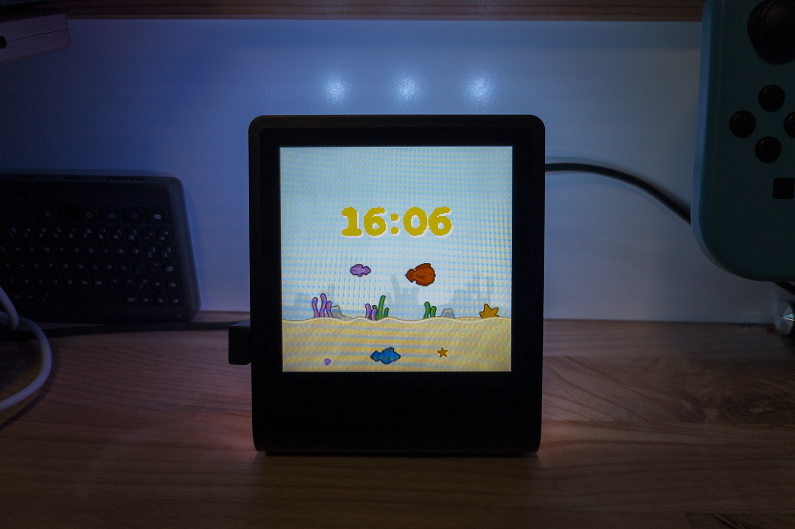

# Fish Tank (Clock)

Upload `main.py`,  `cherry-hq.af`, `secrets.py`, and all the png files to your Presto.

Set your WiFi details in `secrets.py`.

You can change the timezone by modifying `UTC_OFFSET`, you can also disable the clock by changing `SHOW_TIME`.

Graphics from the Kenney Fish Pack: https://kenney.nl/assets/fish-pack