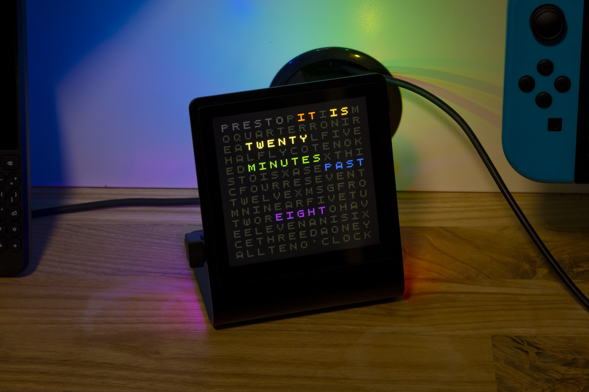

# Word Clock Extra 

Upload `main.py`,  `QuinqueFive.af`, and `secrets.py` to your Presto.

Set your WiFi details in `secrets.py`.

You can change the timezone by modifying `UTC_OFFSET`, you can also make the time appear as white text by modifying `BORING_MODE`.

Font source: https://ggbot.itch.io/quinquefive-font